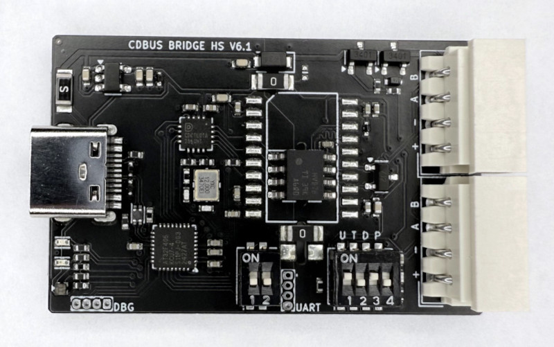
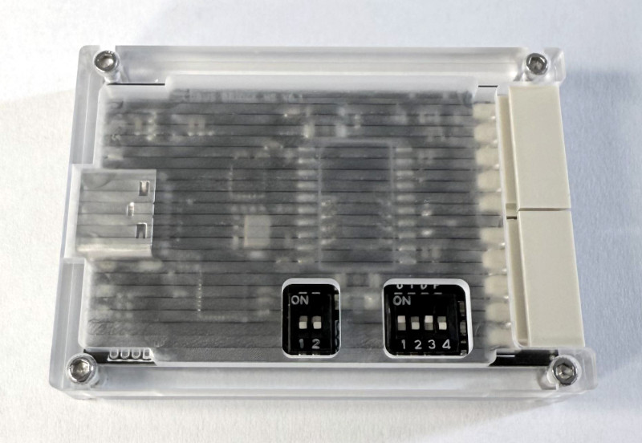
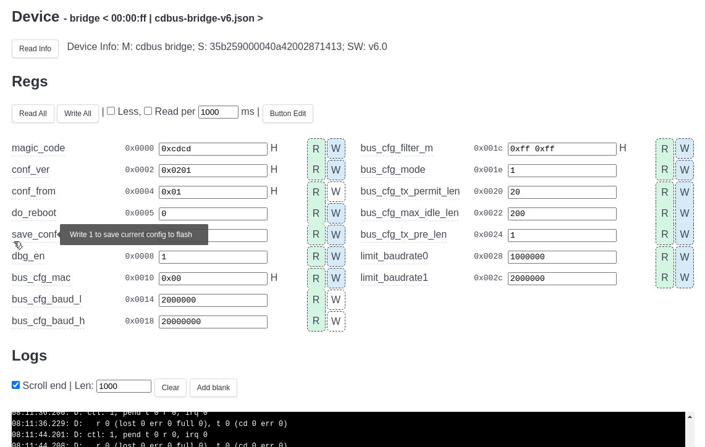

## CDBUS Bridge

The `CDBUS Bridge HS` is a USB-to-RS485 (CDBUS) adapter. The USB port supports `High-Speed`, and the RS485 interface supports up to 50 Mbps.

  


 - The two RS485 ports are internally straight-through, simplifying wiring.

Switchs Defination：
 - S1.1: Force bootloader mode.
 - S1.2: In arbitration mode, the maximum limit of `baud_l`:  
         OFF: Default 1 Mbps; ON: Default 2 Mbps. (modifiable)
 - S2.1: Enable pull-up resistor.
 - S2.2: Enable termination resistor.
 - S2.3: Enable pull-down resistor.
 - S2.4 (HW v6.2+): When enabled together with S2.3, pulls B to 1.65V,
         allowing signal A to operate as a TTL single-wire serial.
 - S2.5 (HW v6.2+) / S2.4: Enable 5V output (should disable when using external power supply).

## Transparent Mode

 - The PC sends complete CDBUS packets (with CRC) via USB serial to the CDBUS Bridge, which forwards them unchanged to the RS-485 bus.
 - Data received from RS-485 is sent unchanged back to the PC via USB serial.
 - The baud rate set by the PC when opening the USB serial port is used for RS-485 (`baud_l` is automatically limited in arbitration mode).
 - The PC must enable the DTR option on the USB serial port.
 - The default RS-485 address of the Bridge is 0. To change it, see the next section.
 - Raw mode allows arbitrary data transfer without following the CDBUS byte format (HW v6.2+).

## Configuration Mode

CDBUS GUI Tool: https://github.com/dukelec/cdbus_gui

When you open the serial port, specify the baud rate as `52685` (`0xcdcd`) to enter the configuration mode.

The target address should be set to `00:00:ff`.

After modifying the configuration, write 1 to `save_conf` to save the changes to flash.

To restore the default configuration, change the value of `magic_code` to a different value, save it to flash, and then power cycle the device.




## Download Source Code

```
git clone --recursive https://github.com/dukelec/cdbus_bridge
```

For other hardware versions, please switch to the corresponding branch.

## Test

```
git clone --recursive https://github.com/dukelec/cdbus_tools
```

```
cd cdbus_tools/
./cdbus_terminal.py --help
```

We can also use a generic serial debugging tool for loopback testing. For example, to simulate node 02 sending a packet to node 00 (with CRC):
```
02 00 01  cd  c1 99
```

If the hardware works properly, the same packet should be received.

