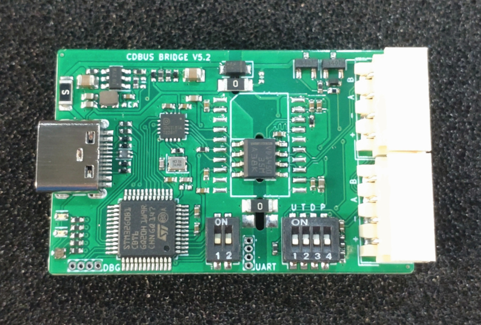
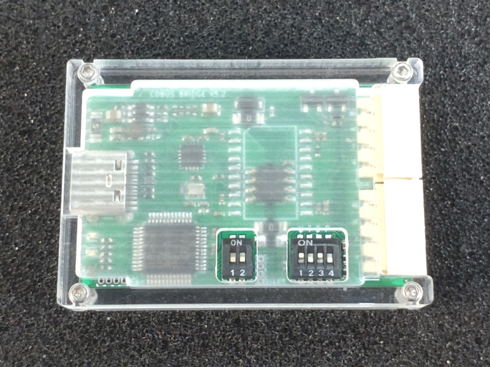

## CDBUS Bridge

  


 - The two RS485 ports are internally straight-through, simplifying wiring.

Switchs Defination：
 - S1.1: Force bootloader mode.
 - S1.2: In arbitration mode, the maximum limit of `baud_l`:  
         OFF: Default 1 Mbps; ON: Default 2 Mbps. (modifiable)
 - S2.1: Enable pull-up resistor.
 - S2.2: Enable termination resistor.
 - S2.3: Enable pull-down resistor.
 - S2.4: Enable 5V output.


## GUI Configuration

CDBUS GUI Tool: https://github.com/dukelec/cdbus_gui

When you open the serial port, specify the baud rate as `52685` (`0xcdcd`) to enter the configuration mode.

The target address should be set to `00:00:ff`.

After modifying the configuration, write 1 to `save_conf` to save the changes to flash.

To restore the default configuration, change the value of `magic_code` to a different value, save it to flash, and then power cycle the device.


## Download Source Code

```
git clone --recursive https://github.com/dukelec/cdbus_bridge
```

## Test

### Prepare
 - Linux: pip3 install pythoncrc pyserial
 - Mac: pip3 install readline pythoncrc pyserial
 - Windows: pip3 install pyreadline pythoncrc pyserial

Please refer scripts' `--help` message and the `Readme.md` under `sw/` folder, e.g.:

```
cd sw/cdbus_tools/
./cdbus_terminal.py --help
```

