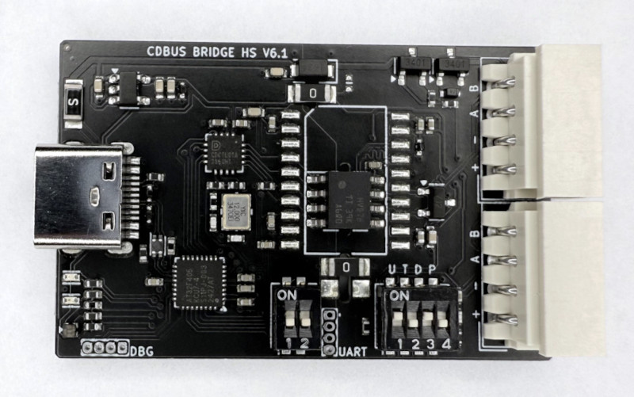
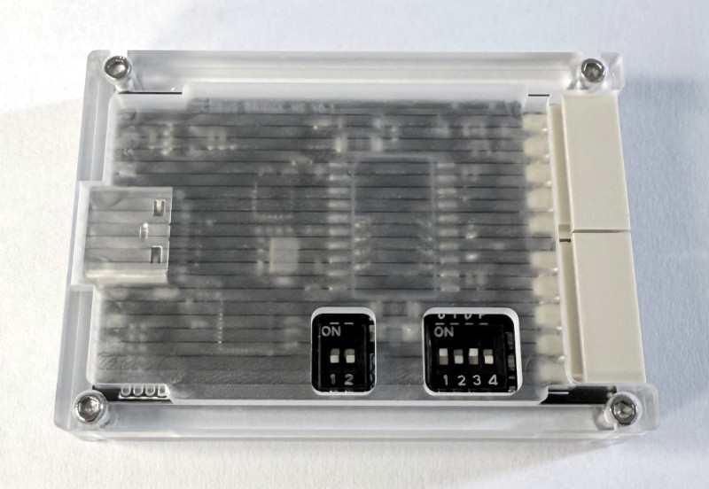
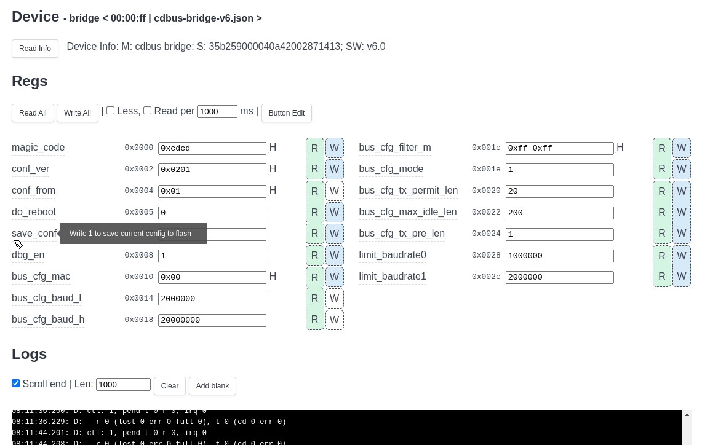

## CDBUS Bridge

The `CDBUS Bridge HS` is a USB-to-RS485 (CDBUS) adapter. The USB port supports `High-Speed`, and the RS485 interface supports up to 50 Mbps.

  


 - The two RS485 ports are internally straight-through, simplifying wiring.

Switchs Defination:
 - S1.1: Force bootloader mode.
 - S1.2: In arbitration mode, the maximum limit of `baud_l`:  
         OFF: Default 1 Mbps; ON: Default 2 Mbps. (modifiable)
 - S2.1: Enable pull-up resistor.
 - S2.2: Enable termination resistor.
 - S2.3: Enable pull-down resistor.
 - S2.4 (HW v6.2+): When enabled together with S2.3, pulls B to 1.65V,
         allowing signal A to operate as a TTL single-wire serial.
 - S2.5 (HW v6.2+) / S2.4: Enable 5V output (should disable when using external power supply).

## Two Ports, One Firmware

The bridge presents both a serial port and an ethernet port, always, and
either may be used. Nothing has to be reflashed to switch between them.

One of them has the bus at a time: the serial port while it is open, the
ethernet port otherwise. Sending works from either. Opening the serial port
is something you do on purpose, while the ethernet interface tends to come
up on its own, so the serial port wins and the existing tools keep working
without anything being taken down first.

### Serial Port (unchanged)

 - The PC sends complete CDBUS packets (with CRC) via USB serial to the CDBUS Bridge, which forwards them unchanged to the RS-485 bus.
 - Data received from RS-485 is sent unchanged back to the PC via USB serial.
 - The baud rate set by the PC when opening the USB serial port is used for RS-485 (`baud_l` is automatically limited in arbitration mode).
 - The PC must enable the DTR option on the USB serial port.
 - The default RS-485 address of the Bridge is 0. To change it, see below.
 - Raw mode allows arbitrary data transfer without following the CDBUS byte
   format (HW v6.2+). The bus then belongs to the serial port alone and the
   ethernet port reports no carrier.

### Ethernet Port

The whole bus is mapped into `fdcd::/104`: the last 3 bytes of an IPv6
address are the CDNET address `level:net:mac` and the UDP port is the CDNET
port. Talking to a device is therefore plain IPv6 UDP.

 - Linux, macOS and Windows 11 have an in-box driver (CDC NCM), nothing to install.
 - No daemon on the host, and no port to open exclusively: several programs
   can use the bus at the same time.
 - Bus traffic goes here whenever the serial port is not open. Close it, or
   leave it alone, and the ethernet port has the bus.
 - The address the host holds *is* the bridge's identity on the bus, so it
   has to match `bus_cfg_mac` and `net` on the device (`00` and `00` by
   default).
 - A CDNET packet has to fit in one CDBUS frame and there is no
   fragmentation, so keep datagrams at 244 bytes or less.

It needs a one-time host setup, see [fw_bridge/host/](fw_bridge/host/). Until
that is done the serial port works as it always has, so the ethernet port is
opt-in.

```python
s = socket.socket(socket.AF_INET6, socket.SOCK_DGRAM)
s.bind(("fdcd::80:0", 50040))
s.sendto(b"...", ("fdcd::80:00fe", 0xcdcd))
```

## Configuration

CDBUS GUI Tool: https://github.com/dukelec/cdbus_gui

The same services (port 1: device info, port 5: config status area, port 8:
flash) are reachable two ways:

 - **Serial**: open the port with the baud rate `52685` (`0xcdcd`) and set
   the target address to `00:00:ff`. The bus is not touched while the port
   is in this mode.
 - **Ethernet**: `fdcd::10:0`, the one address inside the prefix that never
   reaches the bus. It is a node the firmware serves itself.

After modifying the configuration, write 1 to `save_conf` to save the changes to flash.

To restore the default configuration, change the value of `magic_code` to a different value, save it to flash, and then power cycle the device.

Debug output goes to the serial port when `dbg_en` is set (CDNET port 9),
and always goes out on the debug uart. The serial port is there from the
moment the device enumerates, so the boot log, the CSA table included,
waits in its queue and is still there when the port is opened. If the port
is never opened, bus traffic takes those frames back as it needs them.




## Download Source Code

```
git clone --recursive https://github.com/dukelec/cdbus_bridge
```

For other hardware versions, please switch to the corresponding branch.

The `tinyusb` submodule is pinned at an upstream commit rather than at a
release tag, because `0.21.0` predates a batch of `usbd.c` fixes for ways
the device can wedge until it is replugged. Nothing extra to run.

## Test

```
git clone --recursive https://github.com/dukelec/cdbus_tools
```

```
cd cdbus_tools/
./cdbus_terminal.py --help
```

We can also use a generic serial debugging tool for loopback testing. For example, to simulate node 02 sending a packet to node 00 (with CRC):
```
02 00 01  cd  c1 99
```

If the hardware works properly, the same packet should be received.

