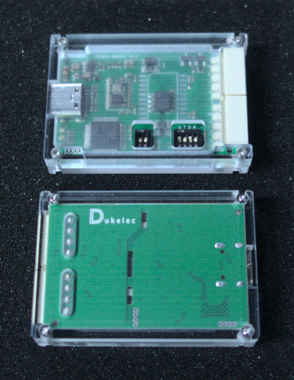

## CDBUS Bridge



CDBUS Bridge 默认是 USB 虚拟串口转 RS485 的工具，RS485 数据包为 CDBUS 格式。

 - USB 串口通訊速率不受所選波特率影響，打开 USB 串口时指定的波特率会被忽略；
 - RS485 波特率需要使用 CDBUS GUI 工具进行配置，因为硬件支持双波特率模式，所以不采用打开 USB 串口时指定的波特率；
 - RS485 波特率可以在上电时，通过左侧开关的 S2 临时设置为 115200 单速率模式，方便快速连接默认波特率的设备；
 - 左侧开关的 S1 切换 bootloader 和 app 模式，关闭为 app 模式；
 - 2 個 RS485 口內部直通，为了方便接線；
 - 右侧开关 S1 是 A 线上拉使能，S2 是 AB 之间终端电阻使能，S3 是 B 线下拉使能，S4 是 USB 对外供电使能。


## GUI Configuration

CDBUS GUI Tool: https://github.com/dukelec/cdbus_gui

把 Bridge 當作目標進行配置時，不要選擇 CDBUS Bridge 選擇框，設置本地 MAC 爲 0xaa，目標地址爲 80:00:55.


<br><br>

修改配置後，往 `save_conf` 寫 1 保存配置到 flash。

如果需要恢復默認配置，修改 `magic_code` 爲其它值，保存到 flash，然後重新上電即可。


## 下載固件

```
git clone --recurse-submodules https://github.com/dukelec/cdbus_bridge.git
```

## 測試

### 安裝依賴包
 - Linux: pip3 install pythoncrc pyserial
 - Mac: pip3 install readline pythoncrc pyserial
 - Windows: pip3 install pyreadline pythoncrc pyserial


請參考 `sw/` 目錄下的 `Readme.md` 以及各腳本的 `--help` 幫助，例如常用的：

```
cd sw/cdbus_tools/
./cdbus_terminal.py --help
```

