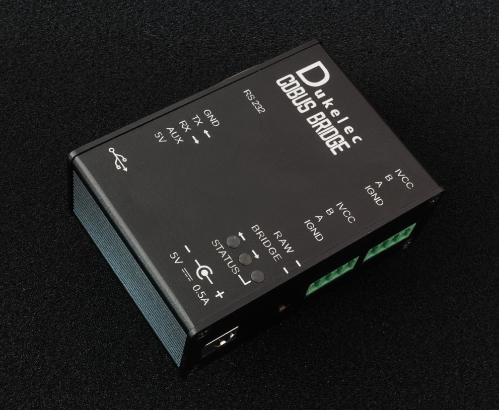
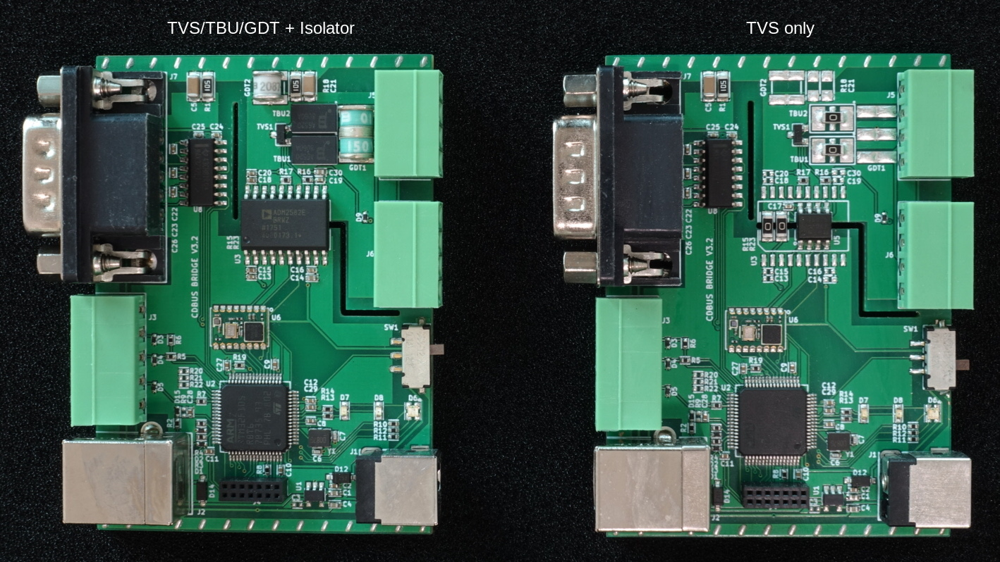
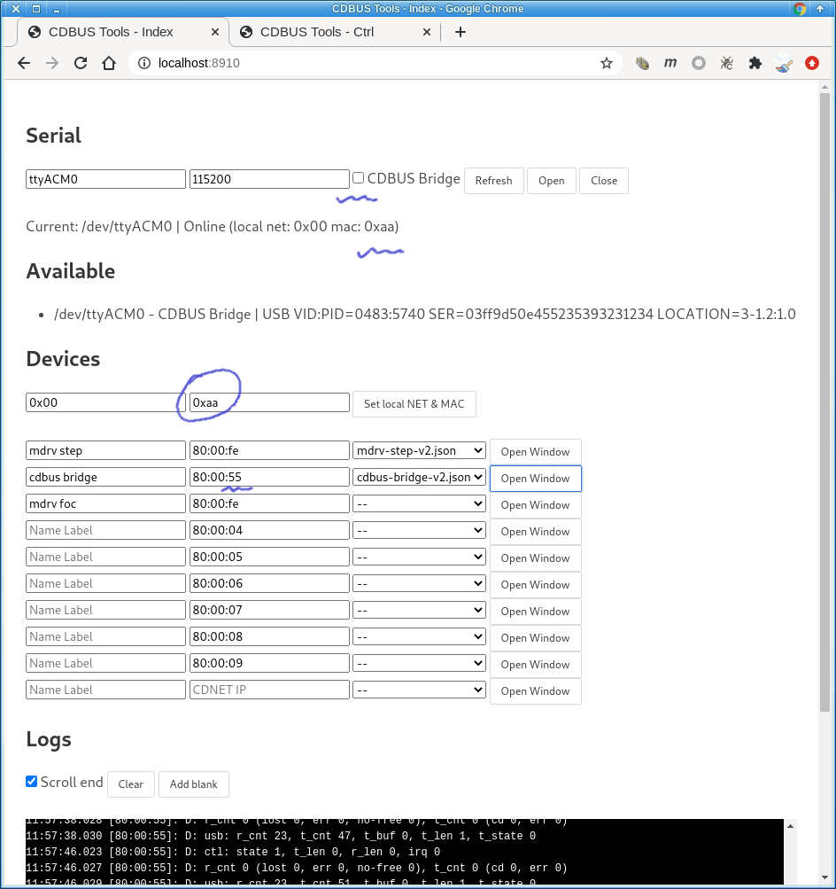
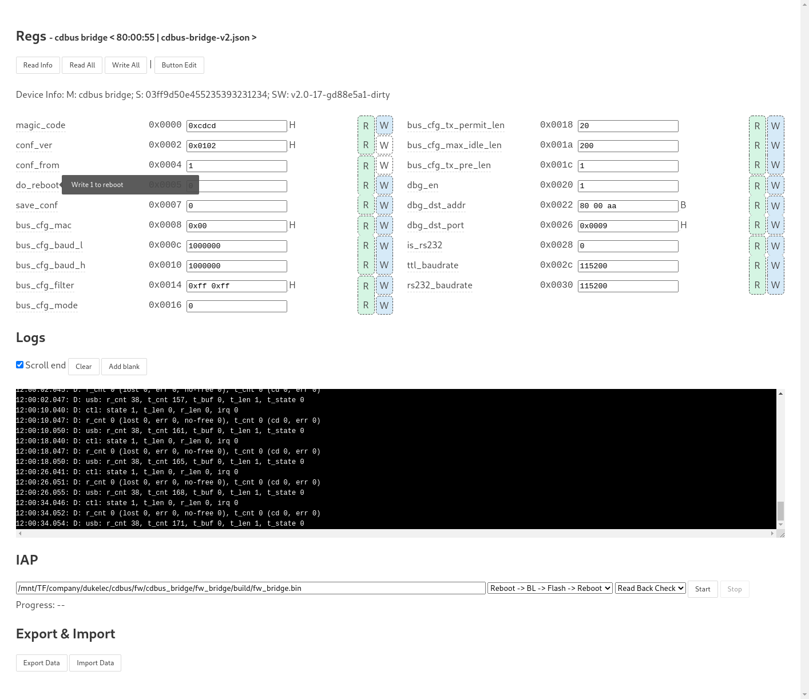

## CDBUS Bridge





CDBUS Bridge 有兩類通訊端口，分別爲 3 個串口和 2 個 RS485 口：
 - 3 個串口同一時間只會有一個處於使用狀態，插入 USB 會優先切換使用免配置的 USB 串口（通訊速率不受所選波特率影響）；
 - 2 個 RS485 口內部直通，方便接線（或上拉、下拉及終端電阻）。

CDBUS Bridge 有兩個模式（需要燒錄不同的固件，默認爲 Bridge 模式）：

### Bridge 模式（串口轉 RS485）

開關定義已更改：上電時，如果開關處於 RAW，則強制使用 115200 波特率。


### Raw 模式（串口透傳）


## GUI Configuration

CDBUS GUI Tool: https://github.com/dukelec/cdbus_gui

把 Bridge 當作目標進行配置時，不要選擇 CDBUS Bridge 選擇框，設置本地 MAC 爲 0xaa，目標地址爲 80:00:55.


<br><br>

修改配置後，往 save_conf 寫 1 保存配置到 flash。

如果需要恢復默認配置，修改 magic_code 爲其它值，保存到 flash，然後重新上電即可。




## 下載固件

```
git clone --recurse-submodules https://github.com/dukelec/cdbus_bridge.git
```

## 測試

### 安裝依賴包
 - Linux: pip3 install pythoncrc pyserial
 - Mac: pip3 install readline pythoncrc pyserial
 - Windows: pip3 install pyreadline pythoncrc pyserial


請參考 `sw/` 目錄下的 `Readme.md` 以及各腳本的 `--help` 幫助，例如常用的：

```
cd sw/cdbus_tools/
./cdbus_terminal.py --help
```

註：上電默認 3 秒為 bootloader 模式，跳轉主程序時狀態燈會閃爍一下，請在這之後再使用相關腳本工具（IAP 除外）。

